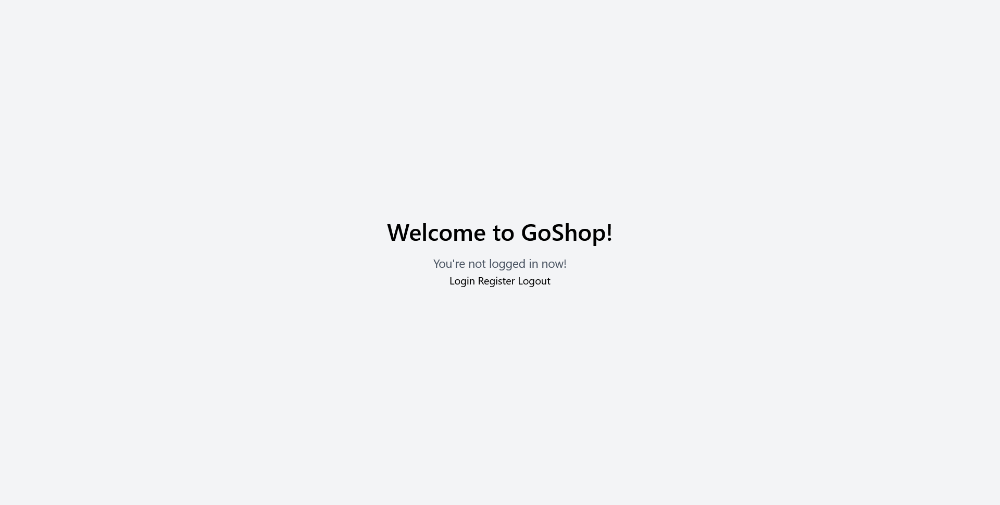

# Project Title: GoShop

## **Brief Description:**
**GoShop** is an e-commerce platform developed using the Go programming language. The project aims to provide a scalable and efficient solution for businesses looking to establish an online presence and sell products. GoShop includes essential features such as product browsing, shopping cart management, user authentication, and order processing to create a seamless online shopping experience.

## Participants:
1. Keneskhan Miras
2. Karsybai Baibolat

## Screenshot:


## Getting Started:
1. **Clone the Repository:**
   ```
   git clone https://github.com/Mirassik/goshop.git
   ```

2. **Navigate to the Project Directory:**
   ```
   cd GoShop
   ```

3. **Build and Run the Application:**
   ```
   go build
   ./GoShop
   ```

4. Open your web browser and go to `http://localhost:8080`

## Features:
- Product catalog with detailed product pages _(in plans)_
- User authentication and registration (realised)
- Shopping cart management _(in plans)_
- Secure checkout process with order confirmation _(in plans)_
- Admin panel for managing products and orders _(in plans)_

## Tools and Technologies:
- Go Programming Language
- HTML/CSS for the frontend
- Gorilla Mux (for routing)
- PostgreSQL (or any preferred database for product and order storage)
- JWT (JSON Web Tokens) for authentication

**References:**
- [Go Documentation](https://golang.org/doc/)
- [Gorilla Mux Documentation](https://pkg.go.dev/github.com/gorilla/mux)
- [SQLite Documentation](https://www.sqlite.org/docs.html)
- [JWT.io](https://jwt.io/introduction/)